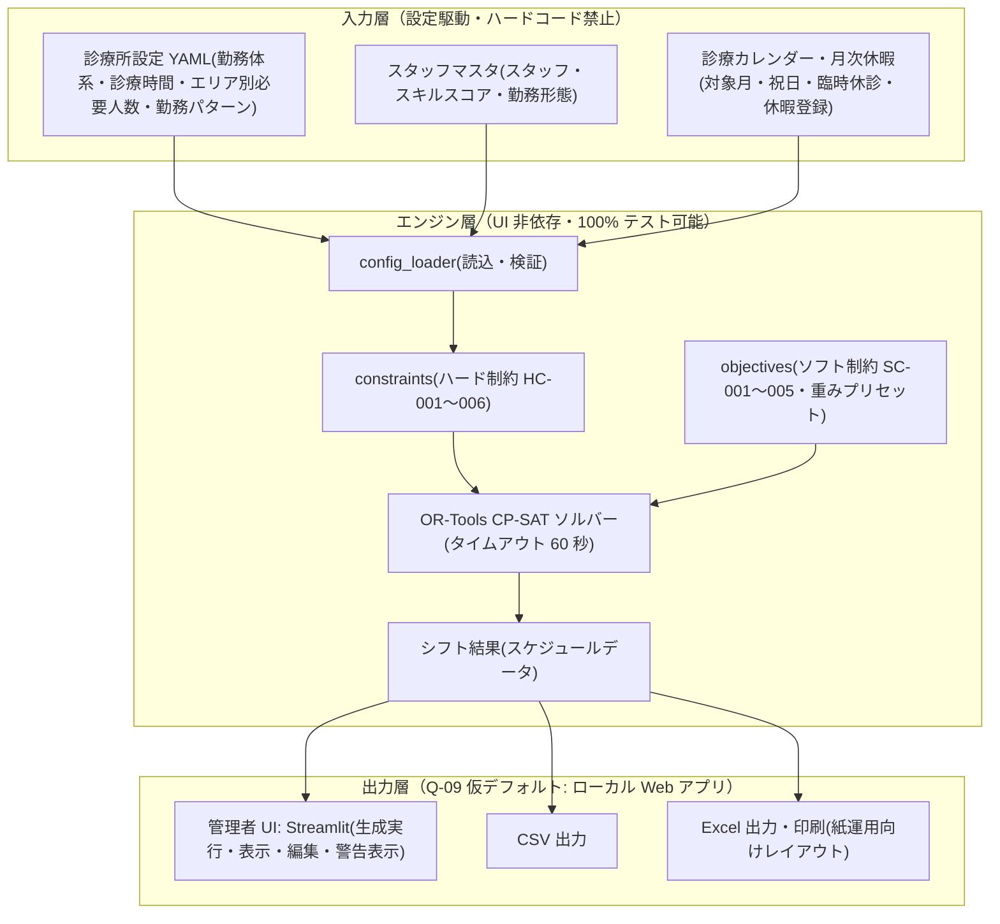
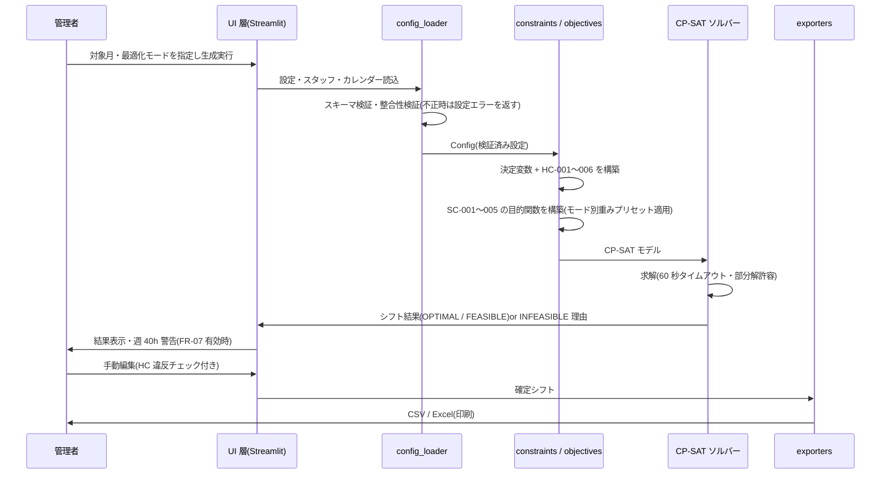

# アーキテクチャ設計書（ARCHITECTURE）

**バージョン**: 0.1.0
**作成日**: 2026-07-03
**対象システム**: clinic-shift-scheduler（シフト作成システム v2）
**ステータス**: 確定（配布形態は Q-09 仮デフォルト前提。回答後の影響範囲は 2.3 節参照）

---

## 目次

1. [本書の位置づけ](#1-本書の位置づけ)
2. [システム全体構成](#2-システム全体構成)
3. [データフロー](#3-データフロー)
4. [UI 技術の選定（テスタビリティ評価）](#4-ui-技術の選定テスタビリティ評価)
5. [モジュール分割方針](#5-モジュール分割方針)
6. [依存ライブラリ一覧](#6-依存ライブラリ一覧)
7. [実装順序リスト（P6 / P7）](#7-実装順序リストp6--p7)
8. [参照文書](#8-参照文書)

---

## 1. 本書の位置づけ

本書は開発ロードマップ P4 の成果物であり、確定済みの要求事項
（`spec/REQUIREMENTS.md`）・制約条件（`spec/CONSTRAINTS.md`）・
技術スタック（`adr/ADR-008-tech-stack.md`）を前提として、
実装全体の構造を確定し、以降の実装 PR を小さく分割可能にするものである。

本書とあわせて以下の設計文書を参照すること。

| 文書 | 内容 |
|------|------|
| `external/input-design.md` | 入力データ設計（設定 YAML スキーマ・スタッフマスタ・診療カレンダー） |
| `external/output-design.md` | 出力設計（画面表示・CSV・Excel 印刷レイアウト仮案） |
| `internal/data-model.md` | データモデル設計（エンティティと関係） |
| `internal/engine-design.md` | 最適化エンジン設計（CP-SAT 変数・HC/SC 実装方針） |

### P4 で確定する設計判断

前フェーズから引き継いだ「P4 で確定する」とされていた事項を、本書で以下のとおり確定する。

| 引き継ぎ事項 | 出典 | 本書での確定内容 |
|-------------|------|----------------|
| UI 技術の選定（仮候補: Streamlit） | ADR-008 | **Streamlit を採用**（4 章。自動テスト手段の有無を必須評価軸として評価） |
| SC-005（半日診療日出勤の均等分散）の採否 | CONSTRAINTS 3 章 | **採用**（重み初期値 50。月次モデル導入後の P6 で実装。`internal/engine-design.md` 参照） |
| 最適化モード別の重みプリセット | CONSTRAINTS 3 章 | **確定**（`internal/engine-design.md` 4 章のプリセット表） |
| HC-005 の明示テスト | CONSTRAINTS 7 章 | **P6 実装順序の先頭に配置**（7 章 P6-1） |
| SC-003（週 40h 上限）の実装形態 | CONSTRAINTS 3 章 | **P7 で確定**（7 章 P7-7 として実装順序に組み込み） |

---

## 2. システム全体構成

### 2.1 全体構成図



### 2.2 レイヤ責務

| レイヤ | 責務 | 実装場所 |
|--------|------|---------|
| 入力層 | 診療所固有の値を設定ファイルとして保持する。コード変更なしに切替可能（REQUIREMENTS 3 章の設定駆動方針） | `config/` |
| エンジン層 | 設定の読込・検証、CP-SAT モデル構築（HC / SC）、求解、結果データへの変換。**UI・配布形態に依存しない** | `02-src/scheduler/` |
| 出力層 | 結果の画面表示・編集（Streamlit）、CSV / Excel 出力 | `02-src/ui/`・`02-src/exporters/` |

設計原則（ADR-008 の P4 以降への設計指針を継承）:

1. **UI 層とロジック層の分離**: エンジン層は UI なしで 100% テスト可能に保つ
   （縦スライスの `02-src/scheduler/` は既にこの構造であり、維持する）
2. **配布形態非依存**: エンジン層は配布形態（Q-09）にいっさい依存しない。
   Q-09 の回答が仮デフォルトと異なっても、影響は出力層（UI・起動方式）に限定される
3. **設定駆動**: 診療所固有の値のハードコード禁止。未確定事項（Q-01〜10）は
   設定初期値として保持し、回答後は設定更新のみで反映する

### 2.3 配布形態（Q-09 仮デフォルト）

ADR-008 に基づき、配布形態の仮デフォルトを**ローカル Web アプリ**
（Python 実行環境 + ブラウザで動作。外部公開なし）として設計する。
副院長の回答待ちで設計・実装は停止しない。

回答が仮デフォルトと異なる場合の影響範囲:

| 回答 | 影響 |
|------|------|
| ローカル Web アプリ（仮デフォルトどおり） | 影響なし |
| デスクトップ実行ファイル | 出力層のみ再設計（UI 技術・配布ビルド）。エンジン層・入力層は無変更 |
| ホスティング | 出力層 + 認証・個人情報保護方針の再検討（ADR-007）。エンジン層は無変更 |

---

## 3. データフロー

シフト生成 1 サイクルのデータの流れ。



要点:

- **検証は入口で完結**: 設定の不備（スロット境界不整合・必要人数に対する
  人員不足等）は `config_loader` の検証で求解前に検出し、設定エラーとして返す
- **INFEASIBLE の扱い**: ハード制約が充足不能な場合、ソルバーは INFEASIBLE を
  返す。UI は「生成不可」とその主要因（休暇過多・必要人数過大等）の調査手がかりを
  提示する（P7 で設計）
- **手動編集は HC チェック付き**: 編集結果がハード制約に違反する場合は警告する
  （編集自体は管理者判断で保存可能とする。FR-05）

---

## 4. UI 技術の選定（テスタビリティ評価）

ADR-008 の決定事項「P4 の UI 技術選定では自動テスト手段の有無を必須評価軸とする」に
基づき、Python 単一言語で UI を構築できる候補を評価した。

| 評価軸 | Streamlit | Flask + テンプレート | NiceGUI |
|--------|-----------|--------------------|---------|
| 自動テスト手段（必須軸） | ◎ 公式テストフレームワーク AppTest（`streamlit.testing.v1`）で UI をヘッドレス実行・検証可能。E2E は Playwright 併用可 | ○ test client で HTTP レベルは可。ただし画面操作の検証は別途 JS/E2E 基盤が必要 | △ pytest プラグインはあるがエコシステムが小さい |
| 表形式データの表示・編集 | ◎ `st.dataframe` / `st.data_editor` が標準装備（シフト表編集と親和） | △ 自作またはJS ライブラリ導入が必要 | ○ グリッドコンポーネントあり |
| 学習・保守コスト | ◎ 単一スクリプト・宣言的。ビルドチェーン不要 | ○ 構造は自由だが定型コードが多い | ○ |
| ローカル Web アプリとの親和性 | ◎ `streamlit run` のみで起動 | ○ | ○ |
| v1 教訓（フロントエンドテスト欠如）への耐性 | ◎ ロジック分離 + AppTest + Playwright の 3 層でテスト可能 | △ | △ |

**決定: Streamlit を採用する。**

- 必須評価軸（自動テスト手段）で唯一、公式のテストフレームワークを持つ
- 管理者専用・単一ユーザーの小規模 UI という要件に対し、機能・コストが釣り合う
- 認証・複雑な画面遷移が必要になった場合（Q-09 でホスティングが選ばれた場合等）は
  本判断を ADR として再評価する

テスト戦略（v1 のフロントエンドテスト欠如の再発防止）:

| 層 | 手段 | ゲート |
|----|------|--------|
| エンジン層 | pytest（UI なしで 100% 実行可能） | カバレッジ 80% 以上・SKIP=FAIL |
| UI 層（コンポーネント） | Streamlit AppTest | 主要画面の操作パスを網羅 |
| E2E | Playwright（CI: GitHub Actions） | 生成→表示→出力の主要シナリオ・flaky detection 適用 |

---

## 5. モジュール分割方針

`02-src/` の目標構成。縦スライス実装（`scheduler/` 3 モジュール）を核として拡張する。

```text
02-src/
├── scheduler/              # エンジン層（UI 非依存・既存を拡張）
│   ├── __init__.py
│   ├── config_loader.py    # 設定読込・スキーマ検証・整合性検証【既存】
│   ├── constraints.py      # ハード制約 HC-001〜006【既存を拡張】
│   ├── objectives.py       # ソフト制約 SC-001〜005・重みプリセット【P6 新規】
│   ├── calendar.py         # 月次カレンダー展開（曜日テンプレート→日付列）【P6 新規】
│   ├── engine.py           # モデル構築・求解・結果抽出のオーケストレーション【既存を拡張】
│   └── result.py           # シフト結果のデータ型と検証（HC 充足チェック）【P6 新規】
├── exporters/              # 出力層: ファイル出力
│   ├── __init__.py
│   ├── csv_exporter.py     # CSV 出力【P6 新規】
│   └── excel_exporter.py   # Excel 出力・印刷レイアウト【P7 新規】
├── ui/                     # 出力層: 管理者 UI（Streamlit）【P7 新規】
│   ├── app.py              # エントリポイント
│   └── pages/              # スタッフ管理・休暇入力・シフト生成・結果編集
└── cli.py                  # シフト生成 CLI（バッチ実行・動作確認用）【P6 新規】
```

分割の原則:

1. **依存方向は一方向**: `ui` / `cli` / `exporters` → `scheduler`。
   `scheduler` から出力層への依存は禁止（import させない）
2. **制約は ID 単位で関数分割**: `add_hc001_...()` 形式（既存踏襲）。
   ソフト制約も `add_sc001_...()` 形式で `objectives.py` に集約し、
   CONSTRAINTS.md の ID と実装の対応を保つ
3. **結果はデータ型で受け渡す**: エンジン層の出力（`result.py`）を
   UI / exporters が共有し、出力形態ごとの再計算をしない
4. **テストは `03-tests/` に対応配置**: `test_engine_*.py`（既存）に加え、
   `test_objectives_*.py`・`test_exporters_*.py`・`test_ui_*.py`（AppTest）を追加する

---

## 6. 依存ライブラリ一覧

| ライブラリ | バージョン方針 | 用途 | 導入時期 | 選定理由 |
|-----------|---------------|------|---------|---------|
| ortools | `>=9.10`（動作確認済み: 9.15 系） | CP-SAT ソルバー | 導入済み | ADR-008。縦スライスで OPTIMAL 解・91% カバレッジを実証済み |
| pyyaml | `>=6.0` | 設定ファイル読込 | 導入済み | 設定駆動方針の実装形式（ADR-008） |
| pytest / pytest-cov | `>=8.0` | テスト・カバレッジ計測 | 導入済み | 縦スライス実績。カバレッジ 80% ゲートの計測手段 |
| streamlit | 最新安定版で下限固定（P7 導入時に確定） | 管理者 UI | P7 | 4 章の評価により採用。AppTest によるテスタビリティ |
| openpyxl | 最新安定版で下限固定（P7 導入時に確定） | Excel 出力 | P7 | 純 Python で xlsx 生成・印刷設定（用紙・向き）を指定可能。Excel 本体不要 |
| playwright（dev） | 最新安定版で下限固定（P7 導入時に確定） | E2E テスト | P7 | UI 層の E2E 自動テスト（4 章のテスト戦略） |

方針（CLAUDE.md「依存関係管理」準拠）:

- 依存は最小限に保ち、追加は PR で理由を明記する
- 標準ライブラリで足りるもの（CSV 出力 = `csv` モジュール等）は依存を増やさない
- pandas は現時点で導入しない（Streamlit の表表示は list/dict でも可能。
  必要性が実装で確認された時点で PR として提案する）

---

## 7. 実装順序リスト（P6 / P7）

以降の実装を「1 PR = 1 行」の粒度に分割する。各 PR はテストを同梱し、
カバレッジ 80% 以上・SKIP=FAIL・AI クロスレビューの各ゲートを通過すること
（`DEVELOPMENT_WORKFLOW.md` の 7 ステップワークフローに準拠）。

### P5: プロジェクトスケルトン・CI 拡張（前提タスク）

P6 着手前に、lint・テスト・カバレッジ 80% ゲートを GitHub Actions に追加する
（ROADMAP P5。既存の pii-check / pr-check と並列）。

### P6: 最適化エンジンコア

| # | PR 単位 | 内容 | 依存 |
|---|---------|------|------|
| P6-1 | **HC-005 明示テスト追加** | 配置可能エリア制約（スキル 0 = 配置不可）の充足を直接検証するテストを追加する。現状 HC-005 は変数生成段階の暗黙的実装のため、後続リファクタリングで壊れても検知できない。**P2 品質チェックからの引き継ぎ事項であり P6 の先頭で実施する** | P5 |
| P6-2 | HC-006 厳格形の設定化 | 「同時に複数名が休憩に入らない」の厳格形を設定 ON/OFF 可能な制約として実装する（CONSTRAINTS 2 章 HC-006 補足。Q-04 仮デフォルト: OFF = 現行どおり組み合わせ保証のみ） | P6-1 |
| P6-3 | 月次カレンダーモデル | 曜日テンプレート（現行の週次モデル）を対象月の日付列に展開する。祝日・臨時休診・日付単位の休暇に対応（`internal/engine-design.md` 6 章・`external/input-design.md` 5 章） | P6-1 |
| P6-4 | SC-001 スキルバランス | 各時間帯の配置スキル平均を目標値に近づける目的関数（受付は医事能力優先） | P6-3 |
| P6-5 | SC-002 連続配置優先 | 同一日内のエリア切替回数を最小化する目的関数 | P6-3 |
| P6-6 | SC-004 勤務回数均等化 | スタッフ間の勤務回数差を最小化する目的関数 | P6-3 |
| P6-7 | SC-005 半日診療日の均等分散 | 木曜・土曜出勤回数のスタッフ間の偏りを最小化する目的関数（P4 で採用確定・重み初期値 50） | P6-6 |
| P6-8 | 最適化モード切替 | バランス / スキル重視 / 日数重視の重みプリセット切替（プリセット値は `internal/engine-design.md` 4 章で確定済み） | P6-4〜7 |
| P6-9 | シフト生成 CLI・CSV 出力 | 設定ファイルを指定して 1 ヶ月分を生成する CLI と CSV 出力（`exporters/csv_exporter.py`）。60 秒以内の性能要件をテストで検証 | P6-3、P6-8 |

**P6 完了条件**（ROADMAP 準拠）: 匿名サンプルデータで 1 ヶ月分のシフトが生成され、
全ハード制約の充足（HC-001〜006）がテストで検証されている。

### P7: 管理者 UI・出力機能

| # | PR 単位 | 内容 | 依存 |
|---|---------|------|------|
| P7-1 | Streamlit スケルトン | `ui/app.py` の骨格・AppTest テスト基盤・起動スクリプト（ダブルクリック起動に相当する簡便さをランチャーで確保） | P6 完了 |
| P7-2 | スタッフ管理画面 | スタッフマスタ（スキルスコア・勤務形態・週勤務日数）の表示・編集（FR-01） | P7-1 |
| P7-3 | 休暇入力画面 | 日付単位の休暇登録（終日・午前休・午後休）（FR-02） | P7-1 |
| P7-4 | シフト生成・結果表示画面 | 対象月・最適化モードを指定して生成実行し、結果を表形式で表示（FR-03）。INFEASIBLE 時の要因手がかり表示を含む | P7-2、P7-3 |
| P7-5 | シフト手動編集 | 生成結果の手動編集と HC 違反チェック表示（FR-05） | P7-4 |
| P7-6 | Excel 出力・印刷 | 月間勤務表の Excel 出力（`external/output-design.md` の印刷レイアウト仮案を実装。FR-06 は Q-01 未確定だが紙運用前提のため先行実装する） | P7-4 |
| P7-7 | **SC-003 実装形態の確定・週 40h 警告表示** | 週 40 時間チェック（FR-07）の実装形態を「ハード制約として付与（現行の縦スライス方式）」vs「違反を許容し警告表示」から確定し、UI の警告表示を実装する。**P2 品質チェックからの引き継ぎ事項**。確定判断は管理者の編集運用（P7-5）との整合で行い、結果を CONSTRAINTS.md へ反映する | P7-5 |
| P7-8 | E2E テスト・仕上げ | Playwright による生成→表示→出力の E2E シナリオ（flaky detection 適用）。README・利用者向け起動手順の整備 | P7-6、P7-7 |

**P7 完了条件**（ROADMAP 準拠）: 管理者がシフト作成の月次業務を一通り実施でき、
Excel / 印刷出力が可能な状態。

### 未確定事項（Q）と実装順序の関係

いずれの Q も実装を停止させない（設定駆動方針）。回答が得られた時点で反映する。

| Q | 反映先 | 反映方法 |
|---|--------|---------|
| Q-01（Excel 出力の要否） | P7-6 | 不要と回答された場合は P7-6 をスコープから外すのみ |
| Q-03 / Q-04 / Q-05 / Q-06 / Q-08 | 設定ファイル | 設定初期値の更新のみ（コード変更なし） |
| Q-07（勤務表記号体系） | P7-6・`external/output-design.md` | 記号マッピングは設定化するため設定更新のみ |
| Q-09（配布形態） | 出力層 | 2.3 節の影響範囲表のとおり |

---

## 8. 参照文書

| 文書 | 場所 |
|------|------|
| 開発ロードマップ | `01-docs/ROADMAP.md` |
| 要求事項定義書（P1 成果物） | `01-docs/spec/REQUIREMENTS.md` |
| 制約条件一覧（P2 成果物） | `01-docs/spec/CONSTRAINTS.md` |
| 技術スタック選定（P3 成果物） | `01-docs/adr/ADR-008-tech-stack.md` |
| 入力データ設計 | `01-docs/design/external/input-design.md` |
| 出力設計 | `01-docs/design/external/output-design.md` |
| データモデル設計 | `01-docs/design/internal/data-model.md` |
| 最適化エンジン設計 | `01-docs/design/internal/engine-design.md` |
| 設定スキーマ定義（現行 schema_version 1） | `config/schema_reference.md` |
| 開発ワークフロー | `01-docs/DEVELOPMENT_WORKFLOW.md` |

---

**文書管理情報**

- バージョン: 0.1.0（初版）
- 作成日: 2026-07-03
- 対象システム: シフト作成システム v2（clinic-shift-scheduler）
