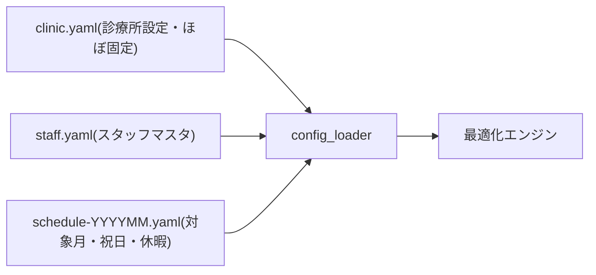

# 入力データ設計（外部設計）

**バージョン**: 0.1.0
**作成日**: 2026-07-03
**対象システム**: clinic-shift-scheduler（シフト作成システム v2）
**ステータス**: 確定（未確定パラメータは仮デフォルト値。7 章参照）

---

## 目次

1. [入力データの全体像](#1-入力データの全体像)
2. [設定ファイルの分割方針](#2-設定ファイルの分割方針)
3. [診療所設定（clinic.yaml）](#3-診療所設定clinicyaml)
4. [スタッフマスタ（staff.yaml）](#4-スタッフマスタstaffyaml)
5. [診療カレンダー・月次入力（schedule-YYYYMM.yaml）](#5-診療カレンダー月次入力schedule-yyyymmyaml)
6. [検証ルール](#6-検証ルール)
7. [未確定事項（Q）と設定項目の対応](#7-未確定事項qと設定項目の対応)
8. [参照文書](#8-参照文書)

---

## 1. 入力データの全体像

入力は「変更頻度」で 3 種類に分ける。診療所固有の値はすべて入力データ側に置き、
ソースコードにハードコードしない（REQUIREMENTS 3 章の設定駆動方針）。

| 入力 | 内容 | 変更頻度 | 編集手段 |
|------|------|---------|---------|
| 診療所設定 | 勤務体系・診療時間・日種別・勤務パターン・エリア別必要人数・オプション機能 | ほぼ変更なし（制度変更時のみ） | ファイル直接編集のみ（画面からの変更不可。REQUIREMENTS 5 章） |
| スタッフマスタ | スタッフ・勤務形態・週勤務日数・スキルスコア | 入退職・評価見直し時 | 管理者 UI（P7 FR-01）+ ファイル |
| 診療カレンダー・月次入力 | 対象月・祝日・臨時休診・日付単位の休暇登録 | 毎月 | 管理者 UI（P7 FR-02）+ ファイル |



---

## 2. 設定ファイルの分割方針

### 現行（schema_version: 1・週次縦スライス）

単一ファイル（`config/samples/sample_clinic.yaml`）に全項目を保持し、
休暇は曜日単位で表現している。テスト・動作確認用として**このまま維持**する。

### 目標（schema_version: 2・月次対応。P6-3 で導入）

運用では「毎月変わるもの（休暇・祝日）」と「変わらないもの（勤務体系・必要人数）」の
更新責務が異なるため、3 ファイルに分割する。

| ファイル | 内容 | 対応章 |
|---------|------|--------|
| `clinic.yaml` | 診療所設定 | 3 章 |
| `staff.yaml` | スタッフマスタ | 4 章 |
| `schedule-YYYYMM.yaml` | 対象月・祝日・臨時休診・当月の休暇登録 | 5 章 |

分割ルール:

- 各ファイルに `schema_version: 2` を記載し、バージョン不一致は読込エラーとする
- 週次（schema_version: 1）の読込は縦スライステストの互換のため当面残し、
  月次実装の安定後に廃止を判断する
- 実運用ファイルは個人情報を含むため**リポジトリに含めない**
  （リポジトリにはサンプル = 架空データのみ置く。ADR-007 / CLAUDE.md 準拠）

---

## 3. 診療所設定（clinic.yaml）

現行 schema_version: 1 の項目構成を継承する（詳細な型定義は
`config/schema_reference.md` が正）。schema_version: 2 での変更点は
スタッフ・休暇の分離のみで、本ファイルの項目は原則不変。

```yaml
schema_version: 2

# 勤務体系（確定値: 拘束 9 時間・休憩 1 時間・実働 8 時間）
work_rules:
  binding_hours: 9
  break_minutes: 60
  working_hours: 8
  break_window: { start: "12:00", end: "15:30" }   # Q-04 仮デフォルト

# オプション機能
options:
  weekly_hours_check:
    enabled: false        # FR-07 週 40 時間チェック（初期 OFF）
    limit_hours: 40
  strict_single_break:
    enabled: false        # HC-006 厳格形: 同時複数名休憩の一律禁止（P6-2 で導入）

slot_minutes: 30          # 時間解像度（分）

# 曜日別の日種別: full / short / half / closed
day_types:
  mon: full
  tue: full
  wed: short              # 午後短縮
  thu: half               # 午前のみ
  fri: full
  sat: half               # 午前のみ（延長）
  sun: closed

# 曜日別の診療時間（表示・文書化用の参考情報。制約は areas.requirements を使用）
clinic_hours:
  mon: { am: ["09:00", "12:30"], pm: ["15:30", "18:30"] }
  # ...（省略。REQUIREMENTS 5.1 節の表と同値）

# 勤務パターン（時差出勤 Q-05 はパターン追加のみで表現）
shift_patterns:
  - { name: early, day_types: [full, short], start: "08:30", end: "17:30", break_minutes: 60 }
  - { name: late,  day_types: [full],        start: "09:30", end: "18:30", break_minutes: 60 }
  - { name: half,  day_types: [half],        start: "08:30", end: "13:30", break_minutes: 0 }

# 業務エリアと曜日別必要人数（Q-06 仮デフォルト）
areas:
  - name: rehab
    required_skills: [rehab]
    requirements: { ... }   # 曜日 -> 時間帯 band のリスト
  - name: reception
    required_skills: [reception_am, reception_pm]
    requirements: { ... }
```

新規項目（schema_version: 2 で追加）:

| キー | 型 | 説明 | 初期値 |
|------|-----|------|--------|
| `options.strict_single_break.enabled` | bool | HC-006 厳格形（同時に複数名が休憩に入ることを一律禁止）の ON/OFF | false |

---

## 4. スタッフマスタ（staff.yaml）

現行の `staff` セクションを独立ファイル化する。項目は現行を維持し、
**休暇（vacations）を本ファイルから除去**して月次入力（5 章）へ移す。

```yaml
schema_version: 2

staff:
  - name: "スタッフA"          # 実運用ファイルはリポジトリ外。リポジトリ内は匿名サンプルのみ
    employment: full_time      # full_time / part_time
    weekly_workdays: 6         # 週の勤務日数上限（HC-003(e)）
    skills:                    # 0〜100。0 = 配置不可（HC-005）
      rehab: 70
      reception_am: 80
      reception_pm: 80
      general: 85
```

| キー | 型 | 説明 |
|------|-----|------|
| `name` | str | スタッフ名（一意）。実名は匿名化ルールに従い、リポジトリ内は「スタッフA」等のみ |
| `employment` | str | `full_time` / `part_time`。パート専用パターンは Q-08 回答後に `shift_patterns` へ追加 |
| `weekly_workdays` | int | 週の勤務日数上限 |
| `skills` | map | スキルスコア 4 項目（rehab / reception_am / reception_pm / general）。0 = 配置不可、1 以上 = 配置可。スコアの大小は SC-001（スキルバランス）が使用 |

---

## 5. 診療カレンダー・月次入力（schedule-YYYYMM.yaml）

月次モデル（P6-3）で新規に導入する。対象月の日付列は
「曜日 → `day_types`（clinic.yaml）」を基本とし、本ファイルの例外定義で上書きする。

```yaml
schema_version: 2

target_month: "2026-08"      # 対象月（YYYY-MM）

# カレンダー例外（祝日・臨時休診・臨時の日種別変更）
calendar_overrides:
  - { date: "2026-08-11", day_type: closed, reason: "祝日" }
  - { date: "2026-08-14", day_type: closed, reason: "夏季休診" }

# 当月の休暇登録（日付単位。FR-02: 終日・午前休・午後休）
vacations:
  - { staff: "スタッフA", date: "2026-08-05", kind: full, paid: true }
  - { staff: "スタッフB", date: "2026-08-20", kind: am,   paid: false }
```

| キー | 型 | 説明 |
|------|-----|------|
| `target_month` | "YYYY-MM" | 生成対象の月 |
| `calendar_overrides[].date` | "YYYY-MM-DD" | 例外日（対象月内であること） |
| `calendar_overrides[].day_type` | str | その日の日種別（full / short / half / closed） |
| `calendar_overrides[].reason` | str | 表示用の理由（任意） |
| `vacations[].staff` | str | スタッフ名（staff.yaml に存在すること） |
| `vacations[].date` | "YYYY-MM-DD" | 休暇日 |
| `vacations[].kind` | str | full（終日）/ am（午前休）/ pm（午後休） |
| `vacations[].paid` | bool | 有給か否か（FR-02 の種別管理。制約計算には影響しない。任意・初期値 false） |

日付展開の規則（`scheduler/calendar.py`）:

1. 対象月の各日について曜日から `day_types` を引き、基本の日種別を決める
2. `calendar_overrides` に該当日があれば日種別を上書きする
3. `closed` の日はシフト生成対象から除外する

---

## 6. 検証ルール

`config_loader` が読込時に検証する（求解前にエラーを検出する方針。
現行実装の検証を継承し、月次分を追加する）。

| # | 検証 | エラー時の扱い |
|---|------|--------------|
| V-01 | `schema_version` の一致 | 読込エラー |
| V-02 | 時刻形式（"HH:MM"）・範囲 | 読込エラー |
| V-03 | 時刻境界が `slot_minutes` の倍数であること | 読込エラー |
| V-04 | `binding_hours * 60 == working_hours * 60 + break_minutes` | 読込エラー |
| V-05 | 休憩ありパターンの拘束・休憩が `work_rules` と一致すること | 読込エラー |
| V-06 | パターン名・エリア名・スタッフ名の一意性 | 読込エラー |
| V-07 | スキルスコアが 0〜100 の範囲であること | 読込エラー |
| V-08 | 必要人数がある日に選択可能な勤務パターンが存在すること | 読込エラー |
| V-09 | 各エリアに配置可能なスタッフが 1 人以上いること | 読込エラー |
| V-10 | 【月次】`calendar_overrides` / `vacations` の日付が対象月内であること | 読込エラー |
| V-11 | 【月次】`vacations[].staff` が staff.yaml に存在すること | 読込エラー |
| V-12 | 【月次】同一スタッフ・同一日の休暇重複がないこと | 読込エラー |

---

## 7. 未確定事項（Q）と設定項目の対応

いずれも仮デフォルト値で設計・実装を前進させ、回答後は**設定値の更新のみ**で反映する
（CONSTRAINTS 5 章と同一の運用）。

| Q-ID | 確認事項 | 対応する設定項目 | 仮デフォルト値 |
|------|---------|----------------|---------------|
| Q-03 | 半日診療日の勤務時間 | `shift_patterns`（half） | 08:30〜13:30・休憩なし |
| Q-04 | 休憩タイミング・水曜の扱い | `work_rules.break_window`・`day_types.wed` | 12:00〜15:30・水曜は short（終日勤務日扱い） |
| Q-05 | 時差出勤の要否 | `shift_patterns`（early / late） | 早出 08:30・遅出 09:30 の 2 パターン |
| Q-06 | 受付の必要人数 | `areas[].requirements` | サンプルはテスト用縮小値（実運用値は回答後に設定） |
| Q-08 | パート・時短勤務の扱い | `staff[].employment`・`weekly_workdays`・（必要なら）`shift_patterns` 追加 | 正職員と同一パターン群 + 週日数上限で制御 |

---

## 8. 参照文書

| 文書 | 場所 |
|------|------|
| アーキテクチャ設計書 | `01-docs/design/ARCHITECTURE.md` |
| 設定スキーマ定義（現行 schema_version: 1 の正） | `config/schema_reference.md` |
| サンプル設定（架空データ） | `config/samples/sample_clinic.yaml` |
| 要求事項定義書（設定駆動方針・設定可能項目一覧） | `01-docs/spec/REQUIREMENTS.md` |
| 制約条件一覧（Q 対応表） | `01-docs/spec/CONSTRAINTS.md` |

---

**文書管理情報**

- バージョン: 0.1.0（初版）
- 作成日: 2026-07-03
- 対象システム: シフト作成システム v2（clinic-shift-scheduler）
