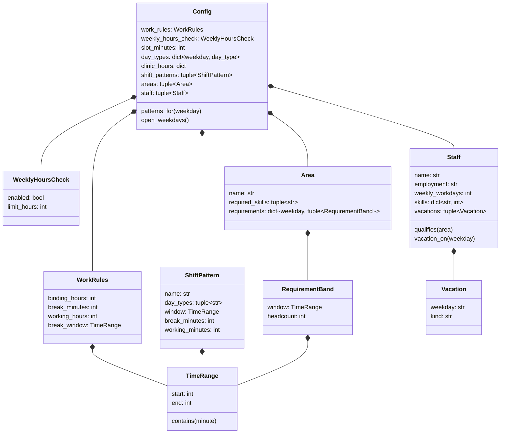
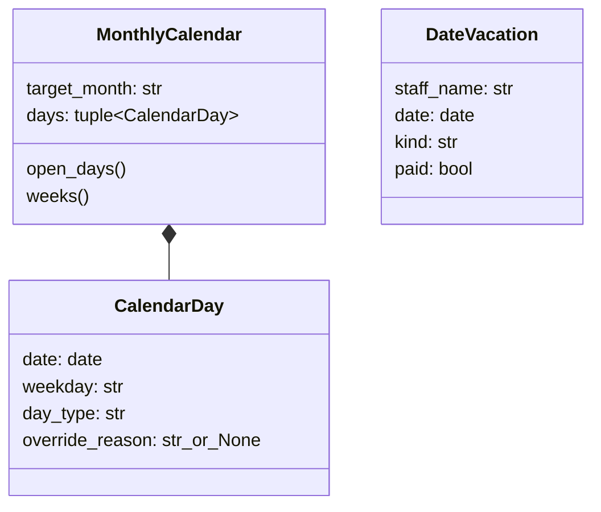
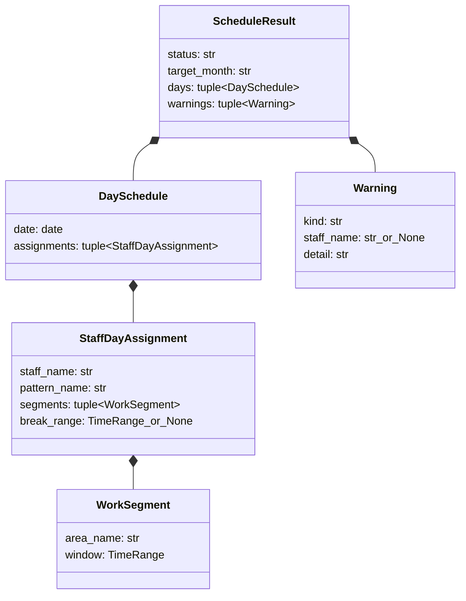

# データモデル設計（内部設計）

**バージョン**: 0.1.0
**作成日**: 2026-07-03
**対象システム**: clinic-shift-scheduler（シフト作成システム v2）
**ステータス**: 確定（月次拡張エンティティは P6-3 で実装）

---

## 目次

1. [モデリング方針](#1-モデリング方針)
2. [エンティティ関係図](#2-エンティティ関係図)
3. [入力側エンティティ（設定モデル）](#3-入力側エンティティ設定モデル)
4. [月次拡張エンティティ（P6-3）](#4-月次拡張エンティティp6-3)
5. [出力側エンティティ（結果モデル）](#5-出力側エンティティ結果モデル)
6. [参照文書](#6-参照文書)

---

## 1. モデリング方針

1. **不変（immutable）データクラス**: 入力側エンティティは `@dataclass(frozen=True)` で
   実装する（縦スライス実装 `scheduler/config_loader.py` の方式を維持）。
   読込・検証後のモデルは変更されないため、エンジンの動作が入力にのみ依存する
2. **時刻は「0 時からの経過分（int）」**: 内部表現は分単位の整数とし、
   "HH:MM" 文字列との変換は境界（読込・出力）でのみ行う。時間演算・スロット判定を
   整数演算に統一する
3. **永続化はファイル**: v2 はデータベースを持たず、入力は YAML・出力は
   CSV / Excel ファイルとする。5〜10 名規模・管理者 1 名の運用では DB の
   同時実行制御・クエリ能力が不要であり、バックアップも
   ファイルコピーで足りる（保守性要件は世代コピーで満たす）
4. **職員タイプはスキルスコアで表現**: TYPE_A〜F のような職員タイプの列挙は持たず、
   「スコア 0 = 配置不可」で配置可能エリアを表現する（CONSTRAINTS HC-005・Q-02 仮デフォルト）。
   タイプ構成が変わってもエンティティ定義は不変

## 2. エンティティ関係図

（月次拡張後は `Vacation.weekday` が `date` に置き換わり、`MonthlyCalendar` が
加わる。4 章参照）

## 3. 入力側エンティティ（設定モデル）

縦スライス実装済み（`scheduler/config_loader.py`）。値域・検証は
`external/input-design.md` 6 章の検証ルールで保証される。

| エンティティ | 属性 | 型・値域 | 説明 |
|-------------|------|---------|------|
| TimeRange | start / end | int（0〜1439・start < end） | 時間帯。`contains(minute)` でスロット包含判定 |
| WorkRules | binding_hours | int | 拘束時間（確定値 9） |
| | break_minutes | int | 休憩時間（確定値 60） |
| | working_hours | int | 実働時間（確定値 8）。拘束 = 実働 + 休憩を検証 |
| | break_window | TimeRange | 休憩を取得できる時間帯（Q-04 仮: 12:00〜15:30） |
| WeeklyHoursCheck | enabled / limit_hours | bool / int | FR-07 週 40 時間チェック（初期 OFF / 40） |
| ShiftPattern | name | str（一意） | 勤務パターン名（early / late / half 等） |
| | day_types | tuple[str] | 選択可能な日種別（full / short / half） |
| | window | TimeRange | 出勤〜退勤（拘束時間の範囲） |
| | break_minutes | int | 0 = 休憩なし（半日パターン） |
| Area | name | str（一意） | エリア名（rehab / reception） |
| | required_skills | tuple[str] | 配置に必要なスキルキー（いずれか 1 つ以上が 1 点以上で配置可） |
| | requirements | dict[weekday, tuple[RequirementBand]] | 曜日別の必要人数時間帯 |
| RequirementBand | window / headcount | TimeRange / int（0 以上） | 時間帯と必要人数（下限） |
| Staff | name | str（一意・リポジトリ内は匿名） | スタッフ名 |
| | employment | str | full_time / part_time |
| | weekly_workdays | int | 週勤務日数上限（HC-003(e)） |
| | skills | dict[str, int]（0〜100） | スキルスコア。0 = 配置不可（HC-005） |
| | vacations | tuple[Vacation] | 休暇（現行は曜日単位。月次で日付単位へ） |
| Vacation | weekday / kind | str / full・am・pm | 休暇の曜日と種別 |
| Config | （集約ルート） | — | 全設定の集約。`patterns_for()` / `open_weekdays()` を提供 |

## 4. 月次拡張エンティティ（P6-3）

週次モデル（曜日キー）から月次モデル（日付キー）への拡張で追加・変更する
エンティティ。入力の仕様は `external/input-design.md` 5 章に対応する。

| エンティティ | 説明 |
|-------------|------|
| CalendarDay | 対象月の 1 日。曜日由来の日種別に `calendar_overrides` を適用済みの値を持つ |
| MonthlyCalendar | 対象月の日付列。`open_days()`（closed 除外）と `weeks()`（週 40h チェック・週勤務日数上限用の暦週分割。月曜起点） |
| DateVacation | 日付単位の休暇（現行 `Vacation`（曜日単位）を置き換える）。`paid` は種別管理用で制約計算に影響しない |

変更方針:

- `Config` は診療所設定 + スタッフマスタの集約に縮小し、月次入力
  （MonthlyCalendar・DateVacation）は生成実行時の引数として分離する
- 制約構築のキーは `(staff名, weekday, ...)` から `(staff名, date, ...)` へ変更する
  （`internal/engine-design.md` 6 章）
- 週の定義は**暦週（月曜〜日曜）**とし、月初・月末の部分週では
  週勤務日数上限・週実働上限をそのまま適用する（部分週は勤務日が少なく
  上限に達しにくいため、按分せず安全側に倒す）

## 5. 出力側エンティティ（結果モデル）

現行実装はネストした dict を返しているが、UI（P7）・exporters（P6-9）から
共有されるため、P6-3 で以下のデータ型に置き換える（`scheduler/result.py`）。

| エンティティ | 説明 |
|-------------|------|
| ScheduleResult | 生成結果のルート。`status` は OPTIMAL / FEASIBLE / INFEASIBLE 等（CP-SAT のステータス名）。INFEASIBLE 時は `days` が空 |
| DaySchedule | 1 日分の割り当て |
| StaffDayAssignment | スタッフ 1 名の 1 日分（選択パターン・勤務セグメント列・休憩時間帯）。出勤しない日は要素を持たない |
| WorkSegment | 連続する同一エリアへの配置時間帯（スロットをマージ済み） |
| Warning | 週 40h 超過等の警告（FR-07 有効時・警告表示方式の場合）。手動編集の HC 違反チェック結果もこの型で表現する |

設計上の要点:

- **結果の自己検証**: `result.py` に「ScheduleResult がハード制約を充足しているか」を
  検証する関数を置く。ソルバー出力の検証（テスト）と手動編集後のチェック（P7-5）を
  同一実装で行い、二重実装を避ける
- **シリアライズ**: ScheduleResult は JSON へ相互変換可能とする
  （UI のセッション保持・手動編集結果の保存に使用）

## 6. 参照文書

| 文書 | 場所 |
|------|------|
| アーキテクチャ設計書 | `01-docs/design/ARCHITECTURE.md` |
| 入力データ設計（YAML スキーマ・検証ルール） | `01-docs/design/external/input-design.md` |
| 最適化エンジン設計（決定変数との対応） | `01-docs/design/internal/engine-design.md` |
| 縦スライス実装（現行データクラス） | `02-src/scheduler/config_loader.py` |
| 制約条件一覧 | `01-docs/spec/CONSTRAINTS.md` |

---

**文書管理情報**

- バージョン: 0.1.0（初版）
- 作成日: 2026-07-03
- 対象システム: シフト作成システム v2（clinic-shift-scheduler）
