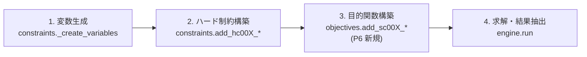

# 最適化エンジン設計（内部設計）

**バージョン**: 0.1.0
**作成日**: 2026-07-03
**対象システム**: clinic-shift-scheduler（シフト作成システム v2）
**ステータス**: 確定（SC-003 の実装形態のみ P7 で確定。4.3 節参照）

---

## 目次

1. [エンジンの構成](#1-エンジンの構成)
2. [決定変数](#2-決定変数)
3. [ハード制約（HC）の実装方針](#3-ハード制約hcの実装方針)
4. [ソフト制約（SC）と目的関数の実装方針](#4-ソフト制約scと目的関数の実装方針)
5. [重みプリセット（最適化モード）](#5-重みプリセット最適化モード)
6. [月次モデルへの拡張（P6-3）](#6-月次モデルへの拡張p6-3)
7. [求解と性能](#7-求解と性能)
8. [参照文書](#8-参照文書)

---

## 1. エンジンの構成

OR-Tools CP-SAT（ADR-008）を用いた制約充足 + 重み付きペナルティ最小化。
処理は 4 段で構成し、モジュールと 1:1 に対応させる。



- 制約・目的関数は **CONSTRAINTS.md の ID と 1:1 の関数**として実装する
  （`add_hc001_area_headcount()` 形式。既存踏襲）。文書と実装の対応が
  常に追跡できることを設計原則とする
- 時間は `slot_minutes`（初期値 30 分）刻みのスロットに離散化する。
  設定の時刻境界はすべてスロット倍数であることを読込時に検証済み

## 2. 決定変数

縦スライス実装（`constraints.py` の `ShiftModel`）を踏襲する。
いずれも BoolVar。月次化でキーの `weekday` が `date` になる（6 章）。

| 変数 | キー | 意味 |
|------|------|------|
| `works` | (staff名, 日, パターン名) | その日そのパターンで勤務するか |
| `assign` | (staff名, 日, エリア名, スロット開始分) | そのスロットでそのエリアに配置されるか |
| `break_start` | (staff名, 日, スロット開始分) | そのスロットから休憩を開始するか |

変数削減の方針（既存実装の維持・強化）:

- **HC-005 は変数を作らないことで表現**: 配置不可エリア（必要スキルのスコアが
  すべて 0）の `assign` 変数はそもそも生成しない。制約式より強い保証だが
  暗黙的なため、P6-1 で明示テスト（生成された変数集合の検証 + 解の検証）を追加する
- `assign` は勤務パターンの時間窓内のスロットのみ生成する
- `break_start` は `break_window` 内で休憩全体が収まる開始スロットのみ生成する

## 3. ハード制約（HC）の実装方針

CONSTRAINTS.md 2 章の HC-001〜006 を CP-SAT の線形制約で表現する。

| ID | 定式化 | 実装状況 |
|----|--------|---------|
| HC-001 必要人数充足 | 各（日, エリア, band 内スロット）: `Σ assign ≥ headcount` | 実装済み |
| HC-002 重複配置禁止 | 各（staff, 日, スロット）: `AddAtMostOne(assign[エリア別])` | 実装済み |
| HC-003 勤務時間制約 | (a) 各（staff, 日）: `AddAtMostOne(works[パターン別])`。(b) 各 assign ≤ そのスロットを含むパターンの works 和。(c) 日内の `Σ assign ≤ Σ works × 実働スロット数`。(d) 休憩ありパターン選択時は `Σ break_start = 1`（休憩スロット中の assign を禁止）。(e) `Σ works（週内）≤ weekly_workdays` | 実装済み |
| HC-004 休暇尊重 | 終日休暇: 当日の works を 0 固定。午前休/午後休: 境界（13:00・内部規約値）で該当スロットの assign を 0 固定 | 実装済み |
| HC-005 配置可能エリア | 変数生成段階で除外（2 章）。**P6-1 で明示テストを追加** | 実装済み（暗黙的） |
| HC-006 休憩交代制（窓口維持） | 基本形は HC-001 × HC-003(d) の組み合わせで充足済み。厳格形（同時に複数名が休憩に入ることの一律禁止）は各（日, スロット）: `Σ_staff Σ_{開始が当該スロットを覆う} break_start ≤ 1` を設定 ON 時のみ付与（`options.strict_single_break.enabled`・初期 OFF） | 実装済み |
| HC-007 空出勤防止 | 各（staff, 日）: 当日の `Σ works ≤ Σ assign`（出勤日には最低1つの配置を伴うことを強制）。P6-6 で SC-004 導入後に発覚した縮退解（3.1 節）への対策として追加 | 実装済み |

### 3.1 HC-007 追加の経緯と一般教訓（P6-6）

SC-004（勤務回数均等化、4.2 節）導入後、`works`（出勤）自体にはコストが
かからず、SC-004 のペナルティは `works` 基準の最大最小差でのみ評価される
ため、配置（`assign`）を一切伴わない出勤（`works=1, assign=0`）を追加する
だけで目的関数を改善できてしまう縮退解が最適とみなされていた（勤務日数が
最小のスタッフにこの「空出勤」を追加すると `min_days` が上がり最大最小差
が縮み、コストなしで目的関数が改善するため）。原因は SC-004 の定式化ミス
ではなく、「`works` の無償化（4.1 節）」と「`works` 基準の均等化圧力
（SC-004）」の組み合わせによるものである。

対策として、HC-007（各 staff・各日: `day_works ≤ day_assign`）を追加し、
出勤日には配置を伴うことを構造的に強制した（`add_hc007_no_empty_attendance()`。
週次・月次共通の `DayContext` 抽象で実装）。

**一般教訓**: 「コストのかからないフラグ変数」+「そのフラグ変数を基準にした
均等化・最小化圧力」の組み合わせは、フラグを実体（配置・実労働等）と
切り離して増減させる縮退解を生みやすい。新しい SC を目的関数に追加する際は、
その SC が参照する変数（本件では `works`）が他の実体的な変数（本件では
`assign`）と常に整合する（無償で乖離できない）ことをハード制約で
担保できているか確認すること。

## 4. ソフト制約（SC）と目的関数の実装方針

### 4.1 目的関数の全体形

P6 で目的関数を以下に再構成する。

```text
minimize  Σ_i  weight_i × penalty_i   （i ∈ {SC-001, SC-002, SC-004, SC-005}）
        + ε × Σ assign                （タイブレーク項・ε = 1）
```

- 現行縦スライスの目的関数（勤務日数 + 配置スロット数の最小化）は、
  SC-004（勤務回数均等化）導入後は役割が重複するため、
  「不要な配置を作らない」ためのタイブレーク項（重み 1）へ縮退させる
- ペナルティはすべて整数変数で表現する（CP-SAT は整数線形のみ扱うため、
  スキル平均等の除算は「合計 × 定数」への変形で回避する）

### 4.2 各 SC の定式化

| ID | ペナルティの定式化 |
|----|-------------------|
| SC-001 スキルバランス | 各（日, エリア, band）について、配置スタッフのスキル合計 `S = Σ score(staff, skill_key) × assign` と目標合計 `T = target_avg × headcount` の乖離 `dev ≥ S − T`・`dev ≥ T − S` を導入し `Σ dev` をペナルティとする（平均の除算を合計比較に変形）。スキルキーはエリアと時間帯で選ぶ: rehab エリア = `rehab`、reception エリアの午前 band = `reception_am`、午後 band = `reception_pm`（医事能力優先の実現）。`target_avg` は設定項目（初期値: 対象スキルの全スタッフ平均） |
| SC-002 連続配置優先 | 各（staff, 日, エリア, 隣接スロット対）に開始検出変数 `start ≥ assign[t] − assign[t−step]` を導入し、日内の `Σ start`（= 連続ブロック数）をペナルティとする。ブロック数最小化はエリア切替・中抜けの最小化と等価 |
| SC-003 週 40h 上限 | ソフト制約だが現行はペナルティではなく**有効時にハード制約として付与**（各 staff・各週: `Σ works × 実働分 ≤ limit_hours × 60`）。実装形態の確定は P7-7（4.3 節） |
| SC-004 勤務回数均等化 | 整数変数 `max_days ≥ Σ works(staff)`（全 staff）・`min_days ≤ Σ works(staff)`（全 staff）を導入し `max_days − min_days` をペナルティとする（最大最小差の最小化）。パートと正職員で基準日数が異なる場合に備え、`weekly_workdays` 比での正規化要否は P6-6 実装時にサンプルデータで評価する |
| SC-005 半日診療日の均等分散 | SC-004 と同形で、対象を半日診療日（day_type = half の日）の出勤回数に限定した最大最小差をペナルティとする。**P4 で採用確定**（土曜・木曜出勤の偏りは SC-004 の総日数均等化では防げないため独立の制約とする） |

### 4.3 SC-003 の実装形態（P7 で確定）

| 方式 | 挙動 | 論点 |
|------|------|------|
| ハード制約方式（現行） | 有効時、上限超過シフトは生成されない | 人員不足月に INFEASIBLE が出やすくなる |
| 警告表示方式（REQUIREMENTS 6.6 の文言） | 超過を許容して生成し、UI・出力で警告する | 管理者の判断余地が残る。手動編集運用と整合的 |

確定は管理者 UI の手動編集（P7-5）の運用が見えた時点（**P7-7**）で行い、
結果を CONSTRAINTS.md 3 章の注記へ反映する。それまでエンジンは現行の
ハード制約方式を維持する（切替は `add_sc003` 実装の差し替えのみで、
他の制約・目的関数に影響しない構造とする）。

## 5. 重みプリセット（最適化モード）

REQUIREMENTS 6.4 の 3 モードは重みプリセットの切替として実現する
（CONSTRAINTS 3 章からの引き継ぎ事項。**本節で初期値を確定**）。
プリセット値は設定ファイルで上書き可能とする。

| ID | バランス（推奨） | スキル重視 | 日数重視 |
|----|----------------|-----------|---------|
| SC-001 スキルバランス | 100 | 300 | 50 |
| SC-002 連続配置優先 | 30 | 30 | 30 |
| SC-004 勤務回数均等化 | 100 | 50 | 300 |
| SC-005 半日診療日の均等分散 | 50 | 25 | 100 |

- バランスモードは CONSTRAINTS 3 章の初期値をそのまま採用する
- 重視モードは該当重みを 3 倍・対抗する重みを 1/2 とする（強調しつつ他制約を
  無視しない比率）。SC-005 は SC-004 と同系（公平性）のため日数重視で連動して増やす
- ペナルティのスケール（dev の単位）が制約間で異なるため、プリセット値は
  P6-8 でサンプルデータの生成結果を観察して再調整してよい（本表は初期値）

## 6. 月次モデルへの拡張（P6-3）

現行の週次モデル（曜日キー・7 日固定）を月次モデル（日付キー・28〜31 日）へ拡張する。

| 項目 | 週次（現行） | 月次（P6-3 以降） |
|------|-------------|------------------|
| 変数キーの「日」 | weekday（mon〜sun） | date（対象月の各日） |
| 日種別 | `day_types[weekday]` | `CalendarDay.day_type`（曜日由来 + カレンダー例外を適用済み） |
| 休暇 | 曜日単位（`Vacation.weekday`） | 日付単位（`DateVacation.date`） |
| 週上限（HC-003(e)・SC-003） | 全体で 1 週間分 | 暦週（月曜〜日曜）ごとに適用。部分週も按分せずそのまま適用（安全側） |

移行方針:

- 変数キーの型を「日識別子」として抽象化し、制約構築コードは週次・月次で共通化する
- 週次スキーマ（schema_version: 1）の読込は既存テストの互換のため当面維持する
  （`external/input-design.md` 2 章）

## 7. 求解と性能

| 項目 | 設計 |
|------|------|
| タイムアウト | 60 秒（非機能要件）。呼び出し側で必ず指定する（CLAUDE.md 準拠） |
| 部分解の扱い | タイムアウト時は FEASIBLE 解（部分解）を採用し、UI に「時間内の最良解」であることを表示する |
| INFEASIBLE 時 | 結果を status のみで返す。要因調査の手がかり提示（休暇集中日・人数不足の検出）は UI 層で読込済み設定から算出する（P7-4） |
| 再現性 | ソルバーの乱数シードを固定し（`random_seed`）、同一入力で同一シフトを返す（管理者の確認・テストの安定性） |
| 並列度 | CP-SAT の既定（自動）を使用する |

規模見積り（性能要件の裏付け）:

- 最大想定（スタッフ 10 名・31 日・2 エリア・1 日 21 スロット・パターン 3 種）で
  `assign` 変数は約 10 × 31 × 2 × 21 ≈ 13,000 個、`works` は約 900 個
- 技術調査（20〜50 名・1 ヶ月分でも数秒）と縦スライス実績（1 週間分で数秒・OPTIMAL）
  から、60 秒制限に対して十分な余裕がある。P6-9 で 1 ヶ月分の生成時間を
  テストで実測・検証する

## 8. 参照文書

| 文書 | 場所 |
|------|------|
| アーキテクチャ設計書（実装順序リスト） | `01-docs/design/ARCHITECTURE.md` |
| データモデル設計（エンティティ定義） | `01-docs/design/internal/data-model.md` |
| 制約条件一覧（HC/SC の定義と根拠） | `01-docs/spec/CONSTRAINTS.md` |
| 技術スタック選定（CP-SAT 採用根拠） | `01-docs/adr/ADR-008-tech-stack.md` |
| 縦スライス実装 | `02-src/scheduler/constraints.py`・`engine.py` |
| 技術調査（性能ベンチマーク） | `01-docs/research/00-summary.md` |

---

**文書管理情報**

- バージョン: 0.1.0（初版）
- 作成日: 2026-07-03
- 対象システム: シフト作成システム v2（clinic-shift-scheduler）
